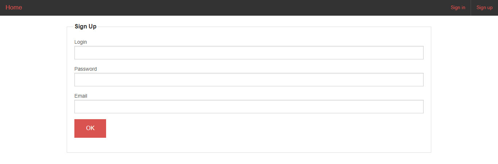
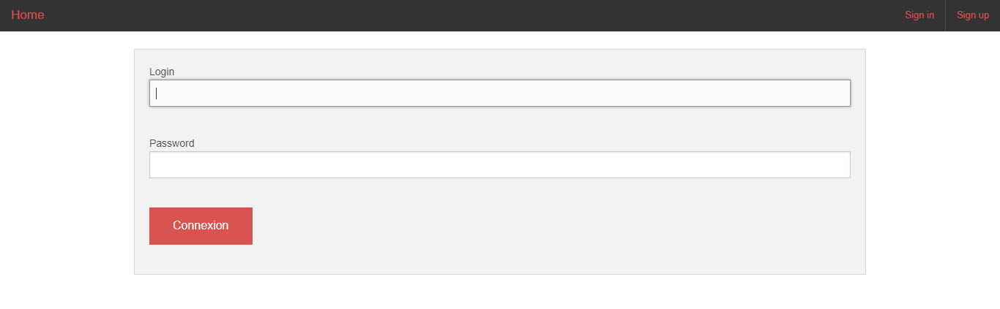
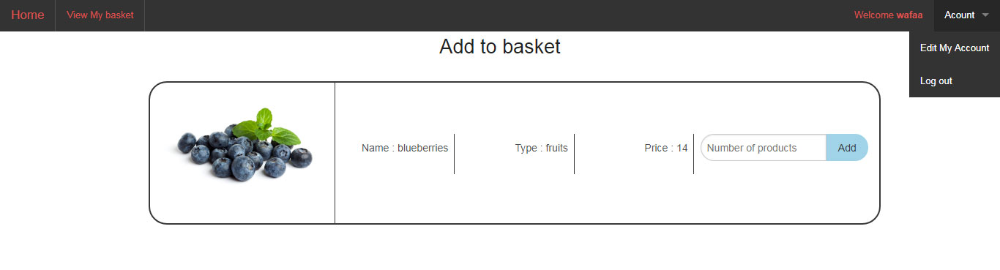
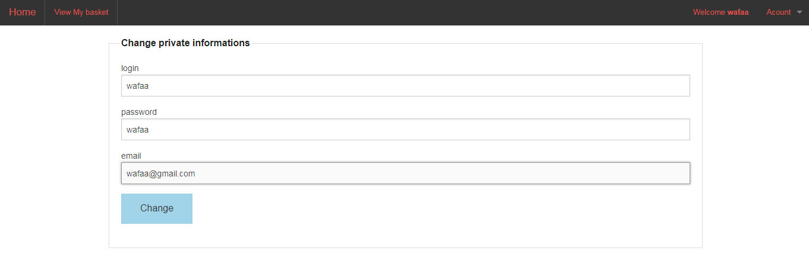
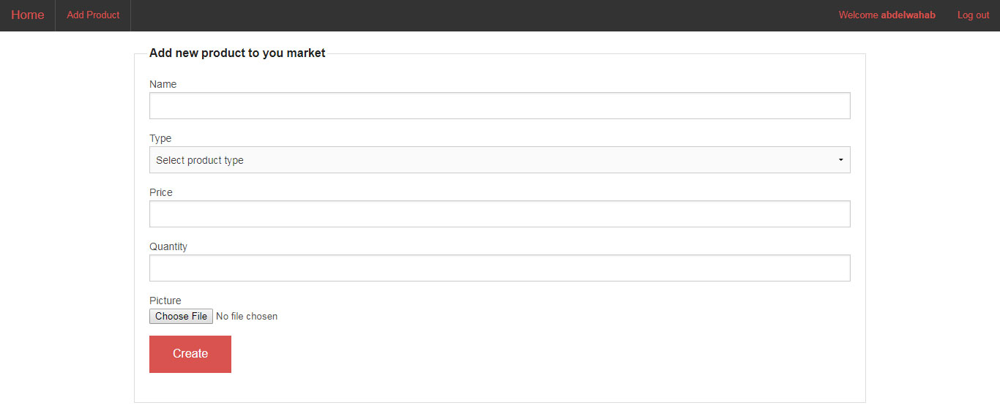
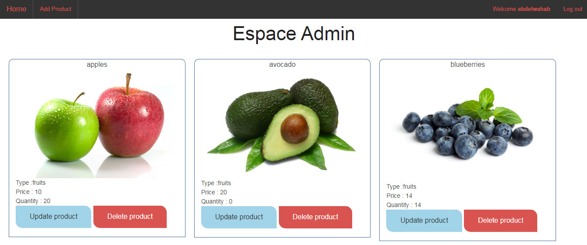
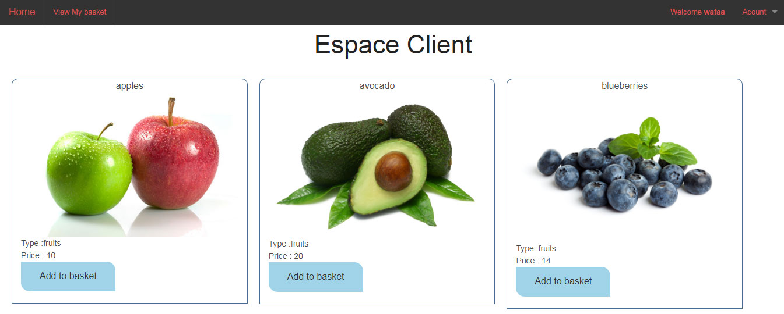
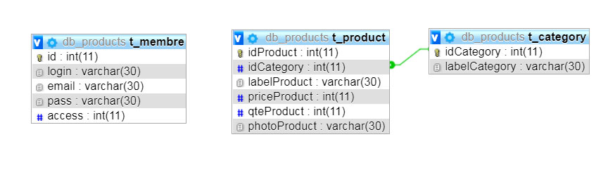

# CodeIgniter

- Vegetables &amp; Fruits
- Application CRUD
- Frameworks :  CodeIgniter & Zurb Foundation
-------------------------------------------------------------------	
	
- View all products
- Access to admin account
- Adding product
- Updating product information
- Deleting product
- Sign up as client
- Access to client account
- Adding product to basket
- Editing client profile

# Screenshot

# Conception

# Configuration
1. Extract files
2. Create a database & configure the file "application/config/database.php" 
>...........Example.............
  'hostname' => 'localhost',
	'username' => 'root',
	'password' => '',
	'database' => 'db_products'

3. Import the file db_products.sql

4. Configure the file "application/config/database.php"

> $config['base_url'] = 'your_path'; 

# Preview
https://www.youtube.com/watch?v=5a4QobPprZc&ab_channel=digital2s
